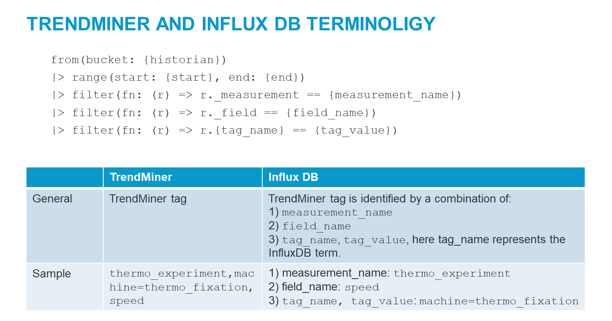
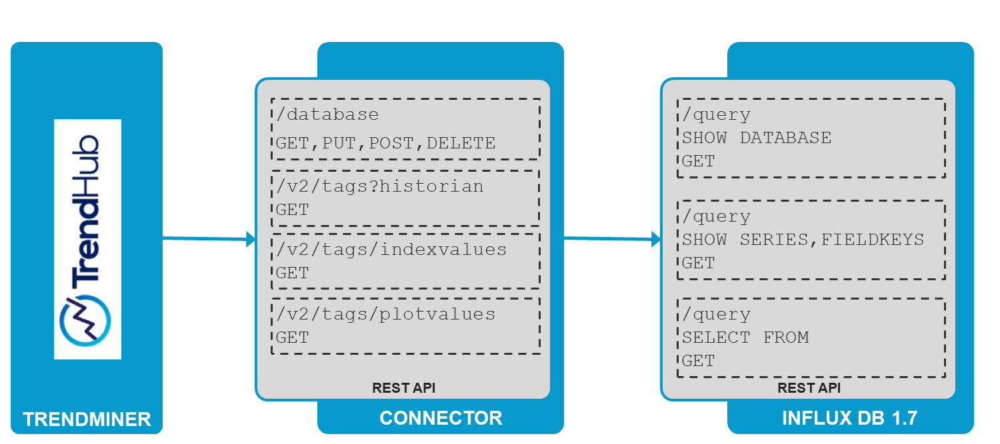
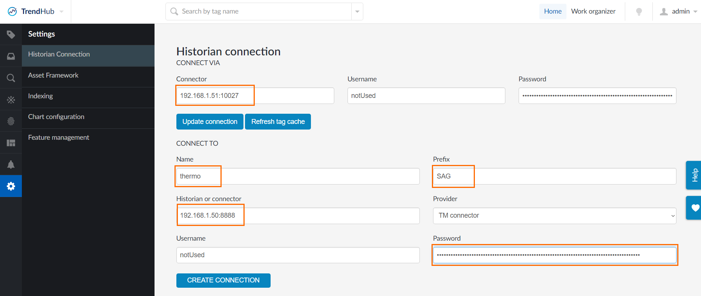

# Influx DB connector for TrendMiner

A TrendMiner timeseries data flow has three main infrastructure components:
1. Data Archive: At first we have the customers' data archive. This data archive is connected to the TrendMiner Plant Integrations Server. 
2. Plant Integrations Server: A Plant Integrations Server can connect to multiple archives. It can also be installed in a DMZ when the TrendMiner servers are in a separate, less secure, network segment.
3. TrendMiner: Lastly the Plant Integrations Server is then connected to TrendMiner.

Customers and partners can also implement a custom connection to TrendMiner through this API. This project provides a connector to connect TrendMiner to a Influx DB DB


# Content
1. [Overview and architecture](#overview-and-architecture)
2. [Prepare project](#prepare-project)
3. [Start connector](#start-connector)
4. [Configure connector](#configure-connector)

## Overview and architecture

The connector allows to connect TrendMiner to a Influx DB. This way timeseries data can be accessed in TrendMinder.   
This project maintains two versions, depending on the Influx DB version. The master branch applies to Influx DB 2.0. The branch influx_17 works with Influx DB 1.7.
The connector follows the API documented by the [Connector API](https://developer.trendminer.com/connector-api).

In order to work with the timeseries data stored in an Influx DB one has to translate the Influx DB terminology to TrendMiner. This can the seen on the following:



In Influx DB a measurment can hold multiple reading values, e.g. temperature, pressure, .... Since TrendMiner works with one reading, multiple Influx DB readings - which can be seen as columns in a table - are split in separate TrendMiner tags.  

Depending on the used version of influx DB - 1.7, 2.0 the architecture look different:  

  

For Influx 1.7. the REST API and Influx queries are used.  


For Influx 2.0. a [Java client library](https://github.com/influxdata/influxdb-client-java) and flux queries are used.  

The connector itself is implementd in Java and uses Spring Boot. The connector stores its configuration data in a PostgreSQL DB. The connection properties have to be provided when starting the connector.

[back to content](#content)

## Prepare project 

1. Clone git repository
```
git clone https://github.com/SoftwareAG/trendminer-influxdb.git
```

2. Run maven build to build docker image for connector

The following command build a docker image  with the tag `tm-influx20-connector:latest`.
```
$ mvn package
...
[INFO] DOCKER> Digest: sha256:68ceb82a12f9c9d80d7d360d5804f5f123acf18bdf7ac0b40cef20c4982f22d1
[INFO] DOCKER> Status: Downloaded newer image for adoptopenjdk/openjdk11:x86_64-alpine-jdk-11.0.6_10
[INFO] DOCKER> Pulled adoptopenjdk/openjdk11:x86_64-alpine-jdk-11.0.6_10 in 20 seconds
[INFO] DOCKER> [tm-influx20-connector:latest]: Built image sha256:c3a1a
[INFO] ------------------------------------------------------------------------
[INFO] BUILD SUCCESS
[INFO] ------------------------------------------------------------------------
[INFO] Total time:  30.378 s
[INFO] Finished at: 2020-04-06T16:23:35+02:00
[INFO] ------------------------------------------------------------------------
```
[back to content](#content)

## Start connector

In order to start the connector one has to provide connectivity properties for a PostgreSQL instance:
1. DB URL: e.g. jdbc:postgresql://127.0.0.1:5432/tm_influx
2. Username: e.g. tm_user
3. Password: e.g. tm_password
After building image tm-influx20-connector run container with:

```
$ docker run -p 10027:10027  --network host \
    -e SPRING_DATASOURCE_URL='jdbc:postgresql://127.0.0.1:5432/tm_influx' \
    -e SPRING_DATASOURCE_USERNAME=tm_user\
    -e SPRING_DATASOURCE_PASSWORD=tm_password\
    tm-influx20-connector:latest   
  
```
When connection to PostgreSQL fails then you have to add --network=postgres_default.  
The IP address of the server where the connector runs will be used when you configure the connection in the TrendHub.

 ## Configure connector

Use TrendMiner TrendHub to configure the connector and provide the following values:
1. Field `Connector`: hostname and IP of the server where you started the connector, see [Start connector](#start-connector)
2. Field `Name`: name of the InfluxDB bucket
3. Field `Prefix`: name of the organization
4. Field `Password`: token used to authorize organization
5. Field `Historian or connector`: hostname and IP of the InfluxDB server  


    


[back to content](#content)
______________________
These tools are provided as-is and without warranty or support. They do not constitute part of the Software AG product suite. Users are free to use, fork and modify them, subject to the license agreement. While Software AG welcomes contributions, we cannot guarantee to include every contribution in the master project.	
______________________
For more information you can Ask a Question in the [TECHcommunity Forums](http://tech.forums.softwareag.com/techjforum/forums/list.page?product=cumulocity).

You can find additional information in the [Software AG TECHcommunity](http://techcommunity.softwareag.com/home/-/product/name/cumulocity).
_________________
Contact us at [TECHcommunity](mailto:technologycommunity@softwareag.com?subject=Github/SoftwareAG) if you have any questions. 